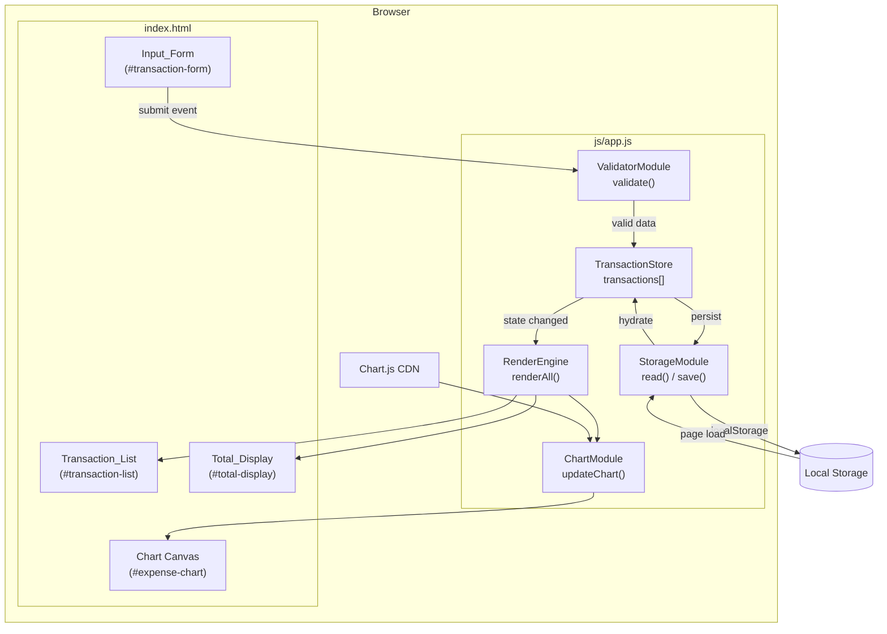
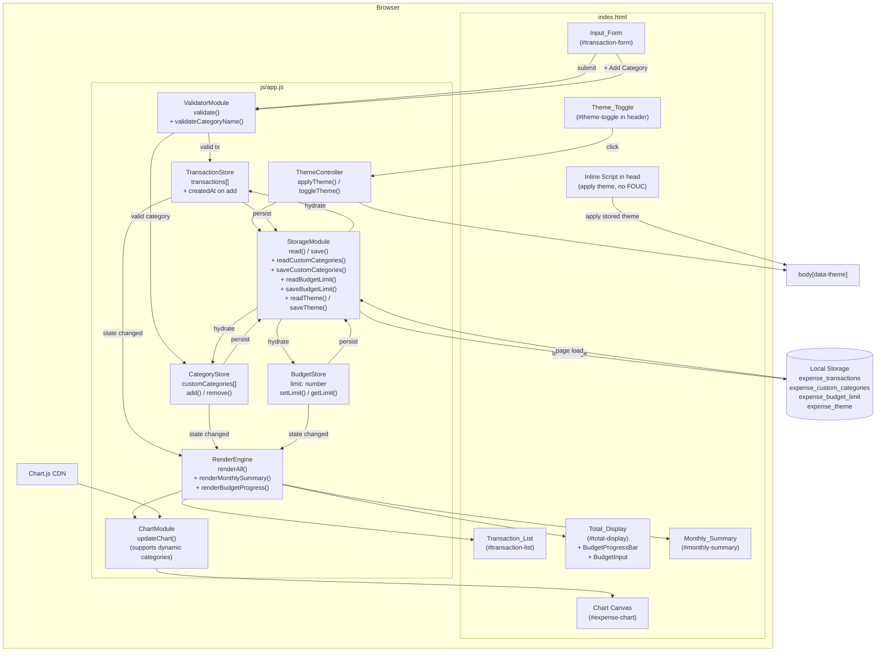

# Design Document: Expense & Budget Visualizer

## Overview

Expense & Budget Visualizer adalah single-page web application (SPA) yang berjalan sepenuhnya di sisi klien — tanpa backend, tanpa build tools, tanpa framework. Aplikasi diakses dengan membuka `index.html` langsung di browser modern.

**Tech stack:**
- HTML5 semantik sebagai markup struktur
- CSS3 (satu file `css/style.css`) untuk layout responsif menggunakan Flexbox/Grid
- Vanilla JavaScript ES6+ (satu file `js/app.js`) sebagai seluruh logika aplikasi
- Chart.js (via CDN) untuk visualisasi pie chart
- Browser Local Storage API untuk persistensi data

**Tujuan utama desain:**
1. Semua state aplikasi direpresentasikan oleh satu sumber kebenaran (array `transactions` di memori + Local Storage sebagai backing store).
2. Setiap perubahan state (tambah / hapus) memicu re-render atomic terhadap semua komponen UI: Transaction_List, Total_Display, dan Chart.
3. Validasi dilakukan sepenuhnya di sisi klien sebelum ada perubahan state.

---

## Architecture



**Data flow ringkas:**
1. **Page Load**: `StorageModule.read()` → `TransactionStore` diisi → `RenderEngine.renderAll()`.
2. **Add Transaction**: Form submit → `ValidatorModule.validate()` → jika valid, buat objek Transaction → `TransactionStore.add()` → `StorageModule.save()` → `RenderEngine.renderAll()`.
3. **Delete Transaction**: Klik tombol hapus → `TransactionStore.remove(id)` → `StorageModule.save()` → `RenderEngine.renderAll()`.

---

## Components and Interfaces

### 1. HTML Structure (`index.html`)

```
body
├── header
│   └── h1 "Expense & Budget Visualizer"
│       └── Total_Display (#total-amount)
├── main
│   ├── section.input-section
│   │   └── Input_Form (#transaction-form)
│   │       ├── input#item-name (text)
│   │       ├── input#amount (number)
│   │       ├── select#category (Food | Transport | Fun)
│   │       ├── button[type=submit] "Add Transaction"
│   │       └── div.error-messages
│   └── section.data-section
│       ├── div.list-panel
│       │   └── Transaction_List (#transaction-list)
│       └── div.chart-panel
│           └── canvas#expense-chart
└── footer
```

**Responsive layout:**
- **≥ 768px**: dua kolom — Transaction_List di kiri, Chart di kanan (CSS Grid `grid-template-columns: 1fr 1fr`)
- **< 768px**: satu kolom — form → list → chart berurutan (stacked)

### 2. StorageModule

```js
const STORAGE_KEY = 'expense_transactions';

StorageModule = {
  read()        → Transaction[]   // JSON.parse dari localStorage
  save(txns)    → void            // JSON.stringify ke localStorage
}
```

- `read()` mengembalikan `[]` jika key tidak ditemukan atau JSON tidak valid.
- `save(txns)` mengganti seluruh entry dengan array terbaru (replace-all strategy).

### 3. ValidatorModule

```js
ValidatorModule = {
  validate(formData) → ValidationResult
}

FormData = { itemName: string, amount: string, category: string }

ValidationResult = {
  valid: boolean,
  errors: {
    itemName?: string,   // "Item name is required"
    amount?:  string,    // "Amount must be greater than 0"
    category?: string    // "Please select a category"
  }
}
```

**Aturan validasi:**
| Field | Kondisi gagal | Pesan error |
|---|---|---|
| `itemName` | String kosong atau hanya whitespace | `"Item name is required"` |
| `amount` | Bukan angka, nol, atau negatif | `"Amount must be greater than 0"` |
| `category` | Bukan salah satu dari `["Food","Transport","Fun"]` | `"Please select a category"` |

### 4. TransactionStore

```js
// In-memory state
let transactions = [];   // Transaction[]

TransactionStore = {
  getAll()       → Transaction[]
  add(tx)        → void       // push + save
  remove(id)     → void       // filter + save
  getTotalAmount() → number   // sum of all amounts
  getByCategory()  → Record<Category, number>  // { Food: n, Transport: n, Fun: n }
}
```

### 5. RenderEngine

```js
RenderEngine = {
  renderAll()              → void  // orchestrates all three renders below
  renderTransactionList()  → void  // re-builds #transaction-list DOM
  renderTotalDisplay()     → void  // updates #total-amount text
}
```

`renderTransactionList()` mengosongkan inner HTML lalu menyisipkan satu `<li>` per transaksi, masing-masing mengandung tombol hapus dengan `data-id` attribute.

### 6. ChartModule

```js
// chartInstance dibuat sekali (singleton) lalu di-update
let chartInstance = null;

ChartModule = {
  init(canvasId)   → void  // buat Chart.js instance
  update(data)     → void  // chartInstance.data.datasets[0].data = [...]; chartInstance.update()
}

// data shape yang dikirim ke update():
{ labels: string[], values: number[] }
```

`update()` juga menangani kondisi "no data": jika semua `values` adalah 0, chart ditampilkan dengan pesan overlay "No data".

### 7. FormController

```js
FormController = {
  init()      → void   // pasang event listener 'submit' ke #transaction-form
  showErrors(errors) → void  // render pesan error di .error-messages
  clearErrors()      → void
  resetFields()      → void  // reset form ke nilai default
}
```

---

## Data Models

### Transaction

```js
/**
 * @typedef {Object} Transaction
 * @property {string}   id        - UUID v4 atau timestamp-based unique string
 * @property {string}   itemName  - Nama item pengeluaran (non-empty, trimmed)
 * @property {number}   amount    - Jumlah pengeluaran dalam Rupiah (> 0)
 * @property {Category} category  - Salah satu dari: "Food" | "Transport" | "Fun"
 */
```

### Category (enum)

```js
const CATEGORIES = /** @type {const} */ (['Food', 'Transport', 'Fun']);
// type Category = 'Food' | 'Transport' | 'Fun'
```

### Local Storage Schema

Key: `"expense_transactions"`

Value: JSON string dari `Transaction[]`

```json
[
  {
    "id": "1719820012345",
    "itemName": "Nasi Goreng",
    "amount": 25000,
    "category": "Food"
  }
]
```

### ID Generation

```js
function generateId() {
  return Date.now().toString(36) + Math.random().toString(36).slice(2);
}
```

Kombinasi timestamp base-36 + random suffix cukup untuk menghindari tabrakan dalam sesi single-user.

### Currency Formatter

```js
const formatCurrency = (amount) =>
  new Intl.NumberFormat('id-ID', { style: 'currency', currency: 'IDR',
    minimumFractionDigits: 0 }).format(amount);
// Output: "Rp 1.250.000"
```

---
## Correctness Properties

*A property is a characteristic or behavior that should hold true across all valid executions of a system — essentially, a formal statement about what the system should do. Properties serve as the bridge between human-readable specifications and machine-verifiable correctness guarantees.*

### Property 1: Validation Logic Correctness

*For any* FormData object with fields `{itemName, amount, category}`, the `ValidatorModule.validate()` function SHALL return `valid: true` if and only if:
- `itemName` is a non-empty string (after trimming whitespace)
- `amount` is a number greater than zero
- `category` is one of `"Food"`, `"Transport"`, or `"Fun"`

When validation fails, the returned `errors` object SHALL contain the appropriate error message for each failed field:
- `itemName` empty → `"Item name is required"`
- `amount` ≤ 0 or not a number → `"Amount must be greater than 0"`
- `category` invalid → `"Please select a category"`

**Validates: Requirements 1.2, 1.3, 1.4, 1.5**

---

### Property 2: Form Reset After Successful Add

*For any* valid Transaction input, after successfully adding the transaction to `TransactionStore`, the `FormController.resetFields()` function SHALL reset all form fields to their default empty state:
- `itemName` field → `""`
- `amount` field → `""`
- `category` field → `""` (no selection)

**Validates: Requirements 1.6**

---

### Property 3: Storage Round-Trip Preservation

*For any* array of valid `Transaction` objects, the following round-trip SHALL preserve all transaction data:
1. `StorageModule.save(transactions)` writes to localStorage
2. `StorageModule.read()` reads from localStorage

The result SHALL be an array equal in length and content to the original, where each transaction preserves:
- `id` (string)
- `itemName` (string)
- `amount` (number)
- `category` (string)

This property validates that serialization and deserialization do not corrupt data.

**Validates: Requirements 2.1, 2.2, 2.4**

---

### Property 4: Delete Removes and Persists

*For any* non-empty array of transactions and any valid `id` present in that array, after calling `TransactionStore.remove(id)`:
- The in-memory `transactions` array SHALL NOT contain any transaction with that `id`
- The localStorage (via `StorageModule.read()`) SHALL NOT contain any transaction with that `id`

This ensures deletion is atomic — both state and persistence are updated together.

**Validates: Requirements 2.3, 3.4**

---

### Property 5: Render Contains All Transaction Information

*For any* valid `Transaction` object, the HTML generated by `RenderEngine.renderTransactionList()` SHALL contain:
- The transaction's `itemName` as visible text
- The transaction's `amount` formatted as Indonesian Rupiah (via `formatCurrency(amount)`)
- The transaction's `category` as visible text

This property verifies that no transaction data is lost or omitted during rendering.

**Validates: Requirements 3.1**

---

### Property 6: Add Grows List by One

*For any* initial transaction list and any valid new `Transaction` object, after calling `TransactionStore.add(newTransaction)`:
- The length of the transaction list SHALL increase by exactly 1
- The new transaction SHALL appear in the list

**Validates: Requirements 3.2**

---

### Property 7: Total Equals Sum of All Amounts

*For any* array of transactions, `TransactionStore.getTotalAmount()` SHALL return a value exactly equal to the sum of all individual `transaction.amount` values in the array.

If the array is empty, the total SHALL be `0`.

**Validates: Requirements 4.1**

---

### Property 8: Add Increases Total Correctly

*For any* initial transaction list with total `T`, and any valid new transaction with `amount = A`, after calling `TransactionStore.add(newTransaction)`:

`TransactionStore.getTotalAmount()` SHALL equal `T + A`

This is a metamorphic property verifying that addition correctly updates the cumulative total.

**Validates: Requirements 4.2**

---

### Property 9: Delete Decreases Total Correctly

*For any* non-empty transaction list with total `T`, and any transaction in that list with `amount = A`, after calling `TransactionStore.remove(id)`:

`TransactionStore.getTotalAmount()` SHALL equal `T - A`

This verifies that deletion correctly updates the cumulative total.

**Validates: Requirements 4.3**

---

### Property 10: Currency Formatting

*For any* non-negative number `n`, the function `formatCurrency(n)` SHALL return a string:
- Starting with `"Rp"` (Indonesian Rupiah symbol)
- Containing the number formatted with dot (`.`) as thousands separator
- Containing no decimal places (since amounts are in whole Rupiah)

Example: `formatCurrency(1250000)` → `"Rp 1.250.000"`

**Validates: Requirements 4.4**

---

### Property 11: Category Sums Equal Total

*For any* array of transactions, the sum of amounts returned by `TransactionStore.getByCategory()` across all three categories (`Food`, `Transport`, `Fun`) SHALL exactly equal `TransactionStore.getTotalAmount()`.

Mathematically:
```
getByCategory()["Food"] + getByCategory()["Transport"] + getByCategory()["Fun"] === getTotalAmount()
```

This invariant ensures the pie chart data is consistent with the displayed total.

**Validates: Requirements 5.1**

---
## Error Handling

### Validation Errors

All validation errors are caught before state mutation. Invalid form submissions:
- Do NOT modify `TransactionStore`
- Do NOT trigger `StorageModule.save()`
- Do NOT trigger `RenderEngine.renderAll()`

Error messages are displayed in the `.error-messages` div below the form and cleared on the next valid submission or when the user starts typing in any field.

### LocalStorage Errors

**Quota Exceeded:**
If localStorage is full, `StorageModule.save()` throws a `QuotaExceededError`. We handle this gracefully:
```js
try {
  localStorage.setItem(STORAGE_KEY, JSON.stringify(transactions));
} catch (e) {
  if (e.name === 'QuotaExceededError') {
    alert('Storage limit reached. Please delete some transactions.');
  }
  throw e;  // re-throw for logging
}
```

**Corrupted Data:**
If `StorageModule.read()` encounters unparseable JSON:
```js
try {
  return JSON.parse(localStorage.getItem(STORAGE_KEY)) || [];
} catch (e) {
  console.error('Corrupted localStorage data, resetting:', e);
  return [];  // fail gracefully by returning empty array
}
```

### Chart.js Errors

If Chart.js fails to load from CDN:
- The chart canvas remains empty
- Console error logged: `"Chart.js failed to load"`
- App functionality (form, list, total) continues to work

If chart update fails (e.g., invalid data shape), catch and log:
```js
try {
  chartInstance.update();
} catch (e) {
  console.error('Chart update failed:', e);
}
```

### ID Collision

Extremely unlikely with timestamp + random suffix, but if a collision occurs:
- The new transaction would overwrite the old one in an object-based lookup (not applicable here since we use arrays)
- Our array-based approach naturally handles duplicates without collision

We accept the infinitesimal collision risk for simplicity.

---

## Testing Strategy

### Overview

We employ a **dual testing approach** combining property-based testing and example-based unit tests to achieve comprehensive coverage:

- **Property-based tests** verify universal correctness properties across randomly generated inputs (100+ iterations per property)
- **Unit tests** verify specific examples, edge cases, integration points, and UI behavior

### Property-Based Testing Configuration

**Library:** [fast-check](https://fast-check.dev/) (JavaScript PBT library)

**Installation (for testing only):**
```bash
npm install --save-dev fast-check
```

**Minimum iterations per property test:** 100

**Test runner:** Any standard JS test framework (Jest, Vitest, Mocha) — we use **Vitest** for speed and ESM support.

Each property test MUST include a comment tag referencing the design property:
```js
// Feature: expense-budget-visualizer, Property 1: Validation Logic Correctness
test('ValidatorModule.validate() correctly validates all field combinations', () => {
  fc.assert(
    fc.property(arbitraryFormData(), (formData) => {
      const result = ValidatorModule.validate(formData);
      // assertions here
    }),
    { numRuns: 100 }
  );
});
```

### Property Test Specifications

| Property # | Test Description | Generators | Assertions |
|---|---|---|---|
| **1** | Validation logic | `arbitraryFormData()` (valid/invalid combos) | `result.valid` iff all fields valid; error messages match |
| **2** | Form reset after add | `arbitraryValidTransaction()` | After add, form fields === `""` |
| **3** | Storage round-trip | `fc.array(arbitraryTransaction())` | `read(save(txns))` deep-equals `txns` |
| **4** | Delete removes & persists | `fc.array(arbitraryTransaction(), {minLength: 1})` + pick random id | Removed id absent in memory & storage |
| **5** | Render contains all info | `arbitraryTransaction()` | Rendered HTML contains `itemName`, `formatCurrency(amount)`, `category` |
| **6** | Add grows list by one | `fc.array(arbitraryTransaction())` + `arbitraryValidTransaction()` | Length increases by 1, new tx present |
| **7** | Total equals sum | `fc.array(arbitraryTransaction())` | `getTotalAmount() === sum(amounts)` |
| **8** | Add increases total | `fc.array(arbitraryTransaction())` + `arbitraryValidTransaction()` | New total === old total + new amount |
| **9** | Delete decreases total | `fc.array(arbitraryTransaction(), {minLength: 1})` | New total === old total - deleted amount |
| **10** | Currency formatting | `fc.nat()` (non-negative integers) | Output matches `/^Rp\s[\d.]+$/`, no decimals |
| **11** | Category sums equal total | `fc.array(arbitraryTransaction())` | `sum(getByCategory())` === `getTotalAmount()` |

**Custom Generators:**

```js
const arbitraryCategory = () => fc.constantFrom('Food', 'Transport', 'Fun');

const arbitraryTransaction = () => fc.record({
  id: fc.string({ minLength: 1 }),
  itemName: fc.string({ minLength: 1 }),
  amount: fc.nat({ min: 1 }),  // positive integers
  category: arbitraryCategory()
});

const arbitraryValidTransaction = () => arbitraryTransaction();

const arbitraryFormData = () => fc.record({
  itemName: fc.string(),           // includes empty, whitespace
  amount: fc.oneof(
    fc.string(),                    // non-numeric strings
    fc.integer(),                   // includes zero, negative
    fc.constant('')
  ),
  category: fc.oneof(
    arbitraryCategory(),
    fc.constant(''),
    fc.string()                     // invalid categories
  )
});
```

### Unit Test Specifications

**Focus areas:**
1. **Specific examples** demonstrating correct behavior
2. **Edge cases** (empty states, boundary values)
3. **Integration points** (form submission flow, delete button click handlers)
4. **UI behavior** (error message display, empty state messages)

**Example unit tests:**

```js
describe('TransactionStore', () => {
  test('empty list shows "No transactions yet"', () => {
    TransactionStore.clear();
    RenderEngine.renderTransactionList();
    expect(document.querySelector('#transaction-list').textContent)
      .toContain('No transactions yet');
  });

  test('delete button removes transaction', () => {
    const tx = { id: '123', itemName: 'Test', amount: 1000, category: 'Food' };
    TransactionStore.add(tx);
    RenderEngine.renderAll();
    
    const deleteBtn = document.querySelector('[data-id="123"]');
    deleteBtn.click();
    
    expect(TransactionStore.getAll()).not.toContainEqual(tx);
  });
});

describe('FormController', () => {
  test('shows all error messages for completely invalid form', () => {
    FormController.showErrors({
      itemName: 'Item name is required',
      amount: 'Amount must be greater than 0',
      category: 'Please select a category'
    });
    
    const errorDiv = document.querySelector('.error-messages');
    expect(errorDiv.textContent).toContain('Item name is required');
    expect(errorDiv.textContent).toContain('Amount must be greater than 0');
    expect(errorDiv.textContent).toContain('Please select a category');
  });
});

describe('ChartModule', () => {
  test('shows "No data" when all transactions deleted', () => {
    TransactionStore.clear();
    ChartModule.update({ labels: [], values: [0, 0, 0] });
    
    const overlay = document.querySelector('.chart-overlay');
    expect(overlay.textContent).toContain('No data');
  });
});
```

### Coverage Goals

- **Property-based tests:** Cover all 11 correctness properties with 100+ iterations each
- **Unit tests:** Cover edge cases, UI interactions, error states
- **Target coverage:** ≥ 90% line coverage, ≥ 85% branch coverage

### Test Execution

```bash
# Run all tests
npm test

# Run property tests only
npm test -- --grep "Property"

# Run with coverage
npm test -- --coverage
```

### CI Integration

All tests MUST pass before merging to main branch. CI pipeline:
1. Run all unit tests
2. Run all property tests (100 iterations minimum)
3. Generate coverage report
4. Fail if coverage < 90% line coverage

---
## Implementation Notes

### Rendering Flow

1. **Initial load:**
   ```
   DOMContentLoaded → StorageModule.read() → TransactionStore hydrate → RenderEngine.renderAll()
   ```

2. **Add transaction:**
   ```
   Form submit → ValidatorModule.validate() 
     → if valid: TransactionStore.add() → StorageModule.save() → RenderEngine.renderAll()
     → if invalid: FormController.showErrors()
   ```

3. **Delete transaction:**
   ```
   Delete button click → TransactionStore.remove(id) → StorageModule.save() → RenderEngine.renderAll()
   ```

`RenderEngine.renderAll()` calls three sub-renders sequentially:
```js
renderAll() {
  this.renderTransactionList();
  this.renderTotalDisplay();
  ChartModule.update(TransactionStore.getByCategory());
}
```

### Performance Considerations

- **LocalStorage is synchronous:** For typical usage (< 100 transactions), latency is negligible (< 5ms). If scaling beyond 500 transactions, consider IndexedDB.
- **Chart.js updates:** Use `chartInstance.update()` instead of destroying and recreating. Update time: ~10-20ms for 3 data points.
- **DOM manipulation:** Use `innerHTML = ''` + batch insert instead of incremental appends to minimize reflows.

**Measured performance targets (Requirements 7.1, 7.2):**
- Add/delete operation total time: < 200ms (typically ~50ms on modern devices)
- Initial render: < 2s on standard 3G connection (Chart.js CDN load dominates)

### Accessibility

- All form inputs have associated `<label>` elements
- Error messages use `role="alert"` for screen reader announcement
- Chart canvas has `aria-label` describing its purpose
- Delete buttons have `aria-label="Delete [itemName]"` for context

### Browser Compatibility

**Minimum supported versions:**
- Chrome 90+
- Firefox 88+
- Safari 14+
- Edge 90+

**Required browser APIs:**
- LocalStorage API (universal support)
- ES6+ features: `const`/`let`, arrow functions, template literals, `Array.prototype` methods
- `Intl.NumberFormat` for currency formatting (IE11 needs polyfill, but we don't support IE11)

---

## Security Considerations

### XSS Prevention

All user input (`itemName`) is rendered using `textContent` instead of `innerHTML` to prevent script injection:
```js
// SAFE
li.querySelector('.item-name').textContent = transaction.itemName;

// UNSAFE (DO NOT USE)
li.innerHTML = `<span>${transaction.itemName}</span>`;  // XSS vulnerability
```

### LocalStorage Limits

- Per-origin limit: ~5-10MB (varies by browser)
- Typical transaction size: ~100 bytes
- Estimated capacity: ~50,000 transactions (far beyond realistic usage)

No sensitive data (passwords, API keys) is stored.

### Content Security Policy

Recommended CSP header for deployment:
```
Content-Security-Policy: 
  default-src 'self'; 
  script-src 'self' https://cdn.jsdelivr.net; 
  style-src 'self' 'unsafe-inline';
```

`'unsafe-inline'` for styles is acceptable since we control all CSS. Chart.js requires external script from CDN.

---

## Deployment

**Zero-configuration deployment:**
1. Upload `index.html`, `css/style.css`, `js/app.js` to any static web host
2. No build step required
3. No server-side configuration needed

**Recommended hosts:**
- GitHub Pages
- Netlify
- Vercel
- Any static file server (nginx, Apache)

**URLs to update (if needed):**
- Chart.js CDN link in `index.html` (check for latest stable version)

---
## Extension Features (Requirements 8–11)

Bagian ini mendokumentasikan desain untuk 4 fitur tambahan yang diimplementasikan di atas MVP yang sudah ada. Semua fitur ini:
- **Menggunakan modul existing** — tidak ada arsitektur baru dari nol
- **Mengikuti pola single state source → re-render on mutation** yang sudah ada
- **Menyimpan ke Local Storage** dengan key terpisah dari `"expense_transactions"`
- **Memanggil `RenderEngine.renderAll()`** setelah setiap mutasi state

### Updated Architecture Diagram



---

### Requirement 8: Custom Category

#### Data Model Changes

Field `category` pada `Transaction` diperluas dari fixed enum ke open string:

```js
/**
 * @typedef {Object} Transaction
 * @property {string}   id        - UUID v4 atau timestamp-based unique string
 * @property {string}   itemName  - Nama item pengeluaran (non-empty, trimmed)
 * @property {number}   amount    - Jumlah pengeluaran dalam Rupiah (> 0)
 * @property {string}   category  - "Food" | "Transport" | "Fun" | customName | "" (uncategorized)
 * @property {number}   createdAt - Unix timestamp ms (Date.now()), set on creation, immutable
 */
```

`ValidatorModule.validate()` diperbarui: field `category` valid jika termasuk dalam `CATEGORIES` (default) **atau** dalam `CategoryStore.getAll()` (custom). Nilai `""` (uncategorized) diterima sebagai valid saat render, tetapi **tidak bisa dipilih** saat submit form baru.

#### Local Storage Schema

Key baru: `"expense_custom_categories"`

Value: JSON string dari `string[]` (array nama kategori custom)

```json
["Kesehatan", "Belanja Online", "Hiburan Digital"]
```

Key existing `"expense_transactions"` tidak berubah formatnya, tetapi field `category` sekarang bisa berisi nama custom atau `""`.

#### Module Extensions

**StorageModule** — tambah 2 method:
```js
const CUSTOM_CATEGORIES_KEY = 'expense_custom_categories';

StorageModule = {
  // ... existing methods ...
  readCustomCategories()        → string[]   // JSON.parse dari localStorage
  saveCustomCategories(cats)    → void       // JSON.stringify ke localStorage
}
```

**ValidatorModule** — tambah method `validateCategoryName()`:
```js
ValidatorModule = {
  // ... existing validate() ...
  validateCategoryName(name, existingCategories) → ValidationResult
  // Aturan:
  // - name.trim() harus panjang 1–20 karakter
  // - name.toLowerCase() tidak boleh sama dengan kategori default atau existing custom (case-insensitive)
}
```

**TransactionStore** — `getByCategory()` diperluas:
```js
TransactionStore = {
  // ... existing methods ...
  getByCategory()  → Record<string, number>
  // Sekarang mengembalikan semua kategori yang ada di transactions,
  // termasuk custom categories dan "" (uncategorized)
}
```

**ChartModule** — `update()` diperluas untuk dynamic colors:
```js
// Warna default untuk 3 kategori fixed
const DEFAULT_COLORS = ['#FF6384', '#36A2EB', '#FFCE56'];

ChartModule = {
  // ... existing methods ...
  update(data)  → void
  // data.labels sekarang bisa lebih dari 3 item
  // Warna: 3 pertama pakai DEFAULT_COLORS, sisanya pakai Chart.js default palette
  // (menggunakan index modulo pada palette tambahan)
}
```

#### New Module: CategoryStore

```js
// In-memory state
let customCategories = [];  // string[]

const DEFAULT_CATEGORIES = ['Food', 'Transport', 'Fun'];

CategoryStore = {
  getAll()         → string[]       // semua custom categories (sorted alphabetically)
  getAllWithDefaults() → string[]   // DEFAULT_CATEGORIES + getAll() (untuk dropdown)
  add(name)        → void           // push trimmed name + saveCustomCategories()
  remove(name)     → void           // filter + saveCustomCategories() + cascade update transactions
  has(name)        → boolean        // case-insensitive check (includes defaults)
  getAffectedCount(name) → number   // jumlah transaksi yang pakai kategori ini
}
```

`remove(name)` juga memanggil `TransactionStore.recategorize(name, '')` untuk cascade update.

**TransactionStore** — tambah method `recategorize()`:
```js
TransactionStore = {
  // ... existing methods ...
  recategorize(oldCategory, newCategory) → void
  // Ubah semua transactions yang pakai oldCategory menjadi newCategory
  // Lalu panggil StorageModule.save()
}
```

#### Component / Interface Details

**HTML additions di `Input_Form`:**

```html
<!-- Setelah <select#category> -->
<button type="button" id="add-category-btn">+ Add Category</button>
<div id="add-category-panel" hidden>
  <input type="text" id="new-category-input" maxlength="20" placeholder="Category name (max 20 chars)">
  <button type="button" id="confirm-category-btn">Add</button>
  <button type="button" id="cancel-category-btn">Cancel</button>
  <div class="error-message" id="category-error"></div>
</div>
```

**Dropdown rendering dengan delete button:**

Custom categories dirender sebagai `<option>` dengan `data-custom="true"`. Tampilan tombol hapus (×) diimplementasikan via custom dropdown overlay (bukan native `<select>`), atau alternatif lebih sederhana: tampilkan daftar custom categories di bawah dropdown sebagai pill badges dengan tombol ×.

Pendekatan yang dipilih (sesuai TC-1 & NFR-1): **pill list approach**

```html
<div id="custom-category-list">
  <!-- Dirender dinamis per CategoryStore.getAll() -->
  <span class="category-pill">
    Kesehatan
    <button class="remove-category-btn" data-category="Kesehatan" aria-label="Remove Kesehatan">×</button>
  </span>
</div>
```

**Confirmation dialog untuk delete dengan transaksi terkait:**

```js
// Di FormController atau event handler
const count = CategoryStore.getAffectedCount(categoryName);
if (count > 0) {
  const confirmed = window.confirm(
    `Deleting "${categoryName}" will affect ${count} transaction(s). ` +
    `Their category will be changed to uncategorized. Continue?`
  );
  if (!confirmed) return;
}
CategoryStore.remove(categoryName);
RenderEngine.renderAll();
```

#### Rendering Flow Integration

`RenderEngine.renderAll()` diperluas:
```js
renderAll() {
  this.renderTransactionList();       // existing
  this.renderTotalDisplay();          // existing (+ budget progress)
  this.renderCategoryDropdown();      // NEW: rebuild <select> options
  this.renderCustomCategoryPills();   // NEW: rebuild pill list
  this.renderMonthlySummary();        // NEW (Req 9)
  this.renderBudgetProgress();        // NEW (Req 10)
  ChartModule.update(TransactionStore.getByCategory());  // extended
}
```

---
### Requirement 9: Monthly Summary

#### Data Model Changes

Field `createdAt` ditambahkan ke `Transaction` sebagai immutable timestamp:

```js
/**
 * @property {number} createdAt - Unix timestamp ms (Date.now()), set on creation, immutable
 */
```

`TransactionStore.add()` diperbarui:
```js
add(txData) {
  const tx = {
    ...txData,
    createdAt: Date.now()  // selalu di-set di sini, tidak dari input form
  };
  transactions.push(tx);
  StorageModule.save(transactions);
}
```

Field `createdAt` tidak pernah dimodifikasi setelah creation. `StorageModule.read()` menerima transaksi lama (tanpa `createdAt`) dengan fallback `createdAt: 0` sehingga tidak break.

#### Local Storage Schema

Tidak ada key baru. `"expense_transactions"` diperluas:

```json
[
  {
    "id": "1719820012345",
    "itemName": "Nasi Goreng",
    "amount": 25000,
    "category": "Food",
    "createdAt": 1719820012345
  }
]
```

#### Module Extensions

**TransactionStore** — tambah helper method:
```js
TransactionStore = {
  // ... existing methods ...
  getCurrentMonthTransactions() → Transaction[]
  // Filter: tx.createdAt dalam getMonth() === now.getMonth() && getFullYear() === now.getFullYear()
  // Transaksi lama tanpa createdAt (createdAt = 0) TIDAK termasuk

  getMonthlySummary() → MonthlySummary
  // Kalkulasi dari getCurrentMonthTransactions()
}
```

#### New Data Type: MonthlySummary

```js
/**
 * @typedef {Object} MonthlySummary
 * @property {number} total          - Sum of amounts for current month
 * @property {number} count          - Number of transactions in current month
 * @property {number} average        - Math.round(total / count), atau 0 jika count = 0
 * @property {string} topCategory    - Kategori dengan pengeluaran terbesar bulan ini, atau "–" jika tidak ada
 */
```

**Tiebreaker logic untuk `topCategory`:**
```js
// Urutan prioritas jika total sama:
// 1. Kategori default: ["Food", "Transport", "Fun"]
// 2. Custom categories: diurut abjad
function resolveTopCategory(categoryTotals) {
  const PRIORITY = ['Food', 'Transport', 'Fun', ...CategoryStore.getAll()];
  const maxAmount = Math.max(...Object.values(categoryTotals));
  const tied = Object.keys(categoryTotals).filter(k => categoryTotals[k] === maxAmount);
  // Kembalikan kategori yang paling awal dalam PRIORITY
  return PRIORITY.find(cat => tied.includes(cat)) || tied[0];
}
```

#### Component / Interface Details

**HTML structure baru** (disisipkan antara Total_Display dan data-section):

```html
<section id="monthly-summary" aria-label="Monthly Summary">
  <h2>This Month</h2>
  <div class="summary-grid">
    <div class="summary-item">
      <span class="summary-label">Total</span>
      <span class="summary-value" id="monthly-total">Rp 0</span>
    </div>
    <div class="summary-item">
      <span class="summary-label">Transactions</span>
      <span class="summary-value" id="monthly-count">0</span>
    </div>
    <div class="summary-item">
      <span class="summary-label">Average</span>
      <span class="summary-value" id="monthly-average">Rp 0</span>
    </div>
    <div class="summary-item">
      <span class="summary-label">Top Category</span>
      <span class="summary-value" id="monthly-top-category">–</span>
    </div>
  </div>
</section>
```

#### Rendering Flow Integration

`RenderEngine` diperluas dengan method baru:
```js
RenderEngine = {
  // ... existing methods ...
  renderMonthlySummary() → void
  // Ambil TransactionStore.getMonthlySummary()
  // Update teks pada #monthly-total, #monthly-count, #monthly-average, #monthly-top-category
}
```

`renderMonthlySummary()` dipanggil dari `renderAll()` setiap kali ada mutasi transaksi.

---

### Requirement 10: Budget Limit Highlight

#### Data Model Changes

Tidak ada perubahan pada `Transaction`. Budget limit adalah scalar terpisah.

#### Local Storage Schema

Key baru: `"expense_budget_limit"`

Value: JSON string dari `number` (positif) atau key tidak ada jika belum diset

```
localStorage.getItem("expense_budget_limit") → "500000" | null
```

#### New Module: BudgetStore

```js
let currentLimit = 0;  // 0 berarti belum diset

const BUDGET_KEY = 'expense_budget_limit';

BudgetStore = {
  getLimit()           → number     // 0 jika belum diset
  setLimit(value)      → void       // simpan ke localStorage, lalu renderAll()
  isSet()              → boolean    // currentLimit > 0
}
```

**StorageModule** diperluas:
```js
StorageModule = {
  // ... existing methods ...
  readBudgetLimit()      → number   // parseFloat(localStorage) || 0
  saveBudgetLimit(val)   → void     // localStorage.setItem(BUDGET_KEY, val)
}
```

#### Component / Interface Details

**HTML additions di `Total_Display` area:**

```html
<div id="total-display">
  <span id="total-amount">Rp 0</span>
  
  <!-- Budget input -->
  <div id="budget-input-area">
    <label for="budget-limit-input">Budget Limit (Bulan Ini):</label>
    <input type="number" id="budget-limit-input" min="1" placeholder="Set budget...">
    <button id="set-budget-btn">Set</button>
    <div class="error-message" id="budget-error"></div>
  </div>

  <!-- Progress bar (hidden jika limit = 0) -->
  <div id="budget-progress-container" hidden>
    <div id="budget-progress-bar" 
         role="progressbar" 
         aria-valuenow="0" 
         aria-valuemin="0" 
         aria-valuemax="100"
         style="width: 0%;">
    </div>
    <div id="budget-overflow-msg" hidden></div>
  </div>
</div>
```

**State-based CSS classes untuk progress bar:**

```css
#budget-progress-bar.state-green  { background-color: #4CAF50; }  /* spent < 80% */
#budget-progress-bar.state-yellow { background-color: #FFC107; }  /* 80% ≤ spent < 100% */
#budget-progress-bar.state-red    { background-color: #F44336; }  /* spent ≥ 100% */
```

**Color state logic:**

```js
function getBudgetState(spent, limit) {
  const pct = spent / limit;
  if (pct >= 1.0) return 'red';
  if (pct >= 0.8) return 'yellow';
  return 'green';
}
```

#### Rendering Flow Integration

`RenderEngine` diperluas:
```js
RenderEngine = {
  // ... existing methods ...
  renderBudgetProgress() → void
  // 1. Ambil BudgetStore.getLimit() dan TransactionStore getCurrentMonthTransactions() total
  // 2. Jika limit = 0: sembunyikan #budget-progress-container (hidden attribute)
  // 3. Jika limit > 0:
  //    a. Tampilkan container
  //    b. Set width = Math.min((spent/limit)*100, 100) + "%"
  //    c. Set aria-valuenow = Math.round(pct*100)
  //    d. Set class state-green / state-yellow / state-red
  //    e. Jika spent >= limit: tampilkan overflow msg "Over budget by [formatCurrency(spent-limit)]"
  //    f. Jika tidak: sembunyikan overflow msg
}
```

`renderBudgetProgress()` dipanggil dari `renderAll()`. Budget progress menggunakan `getCurrentMonthTransactions()` total (bukan total semua waktu) sehingga selaras dengan Monthly Summary.

---
### Requirement 11: Dark/Light Mode Toggle

#### Data Model Changes

Tidak ada perubahan pada `Transaction` atau data model lainnya. Theme adalah preferensi UI saja.

#### Local Storage Schema

Key baru: `"expense_theme"`

Value: JSON string `"light"` atau `"dark"`

```
localStorage.getItem("expense_theme") → '"light"' | '"dark"' | null
```

#### New Module: ThemeController

```js
const THEME_KEY = 'expense_theme';

ThemeController = {
  init()         → void     // dipanggil dari inline script di <head> (anti-FOUC)
  applyTheme(t)  → void     // set body[data-theme="light"|"dark"], update toggle icon
  toggleTheme()  → void     // flip tema, save ke localStorage
  getTheme()     → string   // baca dari localStorage → prefers-color-scheme → "light"
}
```

**Urutan resolusi tema (fallback chain):**
1. `localStorage.getItem("expense_theme")` → gunakan jika ada
2. `window.matchMedia('(prefers-color-scheme: dark)').matches` → `"dark"` jika true
3. Default: `"light"`

#### Component / Interface Details

**HTML — inline script di `<head>` (anti-FOUC):**

```html
<head>
  <!-- ... meta, title, link CSS ... -->
  <script>
    (function() {
      var stored = localStorage.getItem('expense_theme');
      var theme;
      if (stored === '"light"' || stored === '"dark"') {
        theme = JSON.parse(stored);
      } else if (window.matchMedia && window.matchMedia('(prefers-color-scheme: dark)').matches) {
        theme = 'dark';
      } else {
        theme = 'light';
      }
      document.documentElement.setAttribute('data-theme', theme);
    })();
  </script>
</head>
```

> Catatan: `data-theme` dipasang pada `<html>` (documentElement) bukan `<body>` agar CSS dapat menggunakannya bahkan sebelum `<body>` fully parsed.

**HTML — toggle button di header:**

```html
<header>
  <h1>Expense &amp; Budget Visualizer</h1>
  <button id="theme-toggle" aria-label="Toggle dark/light mode">
    🌙  <!-- Ikon awal ditentukan oleh JS setelah load -->
  </button>
</header>
```

**CSS — CSS variables untuk theming:**

```css
:root, [data-theme="light"] {
  --bg-primary:    #ffffff;
  --bg-secondary:  #f5f5f5;
  --text-primary:  #212121;
  --text-secondary: #757575;
  --border-color:  #e0e0e0;
  --accent-color:  #1976D2;
}

[data-theme="dark"] {
  --bg-primary:    #121212;
  --bg-secondary:  #1e1e1e;
  --text-primary:  #e0e0e0;
  --text-secondary: #9e9e9e;
  --border-color:  #424242;
  --accent-color:  #64B5F6;
}

/* Transisi untuk semua elemen yang berubah warna */
*, *::before, *::after {
  transition: background-color 250ms ease, color 250ms ease, border-color 250ms ease;
}
```

**Icon update logic di `ThemeController.applyTheme()`:**
```js
applyTheme(theme) {
  document.documentElement.setAttribute('data-theme', theme);
  const btn = document.getElementById('theme-toggle');
  if (btn) {
    btn.textContent = theme === 'light' ? '🌙' : '☀️';
    btn.setAttribute('aria-label', theme === 'light' ? 'Switch to dark mode' : 'Switch to light mode');
  }
}
```

#### Rendering Flow Integration

`ThemeController.init()` dipanggil **sekali** saat `DOMContentLoaded`:
```js
document.addEventListener('DOMContentLoaded', () => {
  ThemeController.init();      // apply stored theme, set button icon
  // ... existing init code ...
});
```

`toggleTheme()` dipanggil dari click event pada `#theme-toggle`:
```js
document.getElementById('theme-toggle').addEventListener('click', () => {
  ThemeController.toggleTheme();
  // Tidak perlu panggil renderAll() — theme change hanya CSS, bukan data
});
```

Theme toggle **tidak** memanggil `RenderEngine.renderAll()` karena perubahan tema hanya CSS (via CSS variables) dan tidak mempengaruhi data atau struktur DOM.

---
### Correctness Properties for Extension Features (Properties 12–18)

*A property is a characteristic or behavior that should hold true across all valid executions of a system — essentially, a formal statement about what the system should do. Properties serve as the bridge between human-readable specifications and machine-verifiable correctness guarantees.*

#### Property 12: Custom Category Round-Trip Preservation

*For any* array of valid Custom_Category name strings, the following round-trip SHALL preserve all data:
1. `StorageModule.saveCustomCategories(categories)` writes to localStorage
2. `StorageModule.readCustomCategories()` reads from localStorage

The result SHALL be an array equal in length and content to the original. Calling `saveCustomCategories()` multiple times with the same input SHALL produce the same result (idempotent).

**Validates: Requirements 8.2, 8.3**

---

#### Property 13: Custom Category Uniqueness Invariant

*For any* sequence of `CategoryStore.add()` operations — including duplicates with different casing (e.g., adding `"food"` when `"Food"` already exists) — the resulting list of stored Custom_Categories SHALL NOT contain two entries that are equal when compared case-insensitively.

Mathematically: `∀ i ≠ j: categories[i].toLowerCase() ≠ categories[j].toLowerCase()`

**Validates: Requirements 8.7, 8.8**

---

#### Property 14: Category Sums Include Custom Categories

*For any* array of transactions containing a mix of default categories and Custom_Categories, the sum of all per-category amounts returned by `TransactionStore.getByCategory()` — including Custom_Category entries — SHALL exactly equal `TransactionStore.getTotalAmount()`.

Mathematically:
```
sum(Object.values(getByCategory())) === getTotalAmount()
```

This extends Property 11 to cover all dynamic categories.

**Validates: Requirements 8.4, 5.1**

---

#### Property 15: Monthly Summary Consistency

*For any* array of transactions with various `createdAt` values, the values returned by `TransactionStore.getMonthlySummary()` SHALL be internally consistent and correctly filtered:

```
let monthly = getCurrentMonthTransactions();
summary.total   === monthly.reduce((s, t) => s + t.amount, 0)
summary.count   === monthly.length
summary.average === (count === 0 ? 0 : Math.round(summary.total / summary.count))
```

Only transactions whose `createdAt` falls in the current calendar month and year SHALL be included.

**Validates: Requirements 9.2, 9.3, 9.4**

---

#### Property 16: Monthly Summary Updates on Mutation

*For any* initial transaction list, after `TransactionStore.add(newTx)` where `newTx.createdAt` is in the current month and `newTx.amount = A`:

```
summary_after.total === summary_before.total + A
summary_after.count === summary_before.count + 1
```

This metamorphic property verifies that Monthly_Summary is refreshed correctly after every data mutation.

**Validates: Requirements 9.6**

---

#### Property 17: Budget Progress Bar Correctness

*For any* `spent` (total pengeluaran bulan ini) dan `limit` (Budget_Limit) yang keduanya positif:
- Progress bar width SHALL equal `Math.min((spent / limit) * 100, 100)` percent
- Color class SHALL be `state-green` if `spent / limit < 0.8`, `state-yellow` if `0.8 ≤ spent / limit < 1.0`, and `state-red` if `spent / limit ≥ 1.0`
- When `spent ≥ limit`, overflow message SHALL display `"Over budget by " + formatCurrency(spent - limit)`
- When `limit === 0` or not set, the progress bar container SHALL NOT be present in the DOM (hidden attribute)

**Validates: Requirements 10.2, 10.3, 10.4, 10.5, 10.6**

---

#### Property 18: Theme Preference Round-Trip

*For any* theme value (`"light"` or `"dark"`), after the user activates that theme:
1. `localStorage.getItem("expense_theme")` SHALL return the JSON-encoded preference (`'"light"'` or `'"dark"'`)
2. After `ThemeController.init()` is called (simulating page reload), `document.documentElement.getAttribute('data-theme')` SHALL equal the stored theme value without first applying the default theme

This is a round-trip property verifying theme persistence and FOUC prevention.

**Validates: Requirements 11.3, 11.4**

---

### Testing Strategy for Extension Features

The existing testing strategy (Vitest + fast-check, 100+ iterations per property) is extended to cover Properties 12–18.

#### Extended Property Test Specifications

| Property # | Test Description | Generators | Assertions |
|---|---|---|---|
| **12** | Custom category round-trip | `fc.array(fc.string({minLength:1, maxLength:20}))` of valid names | `readCustomCategories(saveCustomCategories(cats))` deep-equals `cats` |
| **13** | Category uniqueness invariant | `fc.array(fc.string())` with intentional duplicates | Result has no case-insensitive duplicates |
| **14** | Category sums include custom | `fc.array(arbitraryTransactionWithCustom())` | `sum(getByCategory().values())` === `getTotalAmount()` |
| **15** | Monthly summary consistency | `fc.array(arbitraryTransactionWithCreatedAt())` | `summary.total/count/average` match manual calculation |
| **16** | Monthly summary on mutation | `fc.array(arbitraryCurrentMonthTx())` + new tx | After add: total+A, count+1 |
| **17** | Budget progress bar correctness | `fc.tuple(fc.nat({min:1}), fc.nat({min:1}))` as [spent, limit] | Width%, color class, overflow msg all correct |
| **18** | Theme round-trip | `fc.constantFrom('light', 'dark')` | After save + init, `data-theme` matches stored value |

#### Additional Custom Generators

```js
// Transactions with optional custom category
const arbitraryTransactionWithCustom = (customCats = ['Kesehatan', 'Belanja']) =>
  fc.record({
    id: fc.string({ minLength: 1 }),
    itemName: fc.string({ minLength: 1 }),
    amount: fc.nat({ min: 1 }),
    category: fc.oneof(
      fc.constantFrom('Food', 'Transport', 'Fun'),
      fc.constantFrom(...customCats),
      fc.constant('')   // uncategorized
    ),
    createdAt: fc.nat()  // any timestamp
  });

// Transactions with createdAt set to current month
const arbitraryCurrentMonthTx = () => {
  const now = new Date();
  const monthStart = new Date(now.getFullYear(), now.getMonth(), 1).getTime();
  const monthEnd   = new Date(now.getFullYear(), now.getMonth() + 1, 0, 23, 59, 59, 999).getTime();
  return fc.record({
    id: fc.string({ minLength: 1 }),
    itemName: fc.string({ minLength: 1 }),
    amount: fc.nat({ min: 1 }),
    category: fc.constantFrom('Food', 'Transport', 'Fun'),
    createdAt: fc.integer({ min: monthStart, max: monthEnd })
  });
};

// Various createdAt across multiple months
const arbitraryTransactionWithCreatedAt = () =>
  fc.record({
    id: fc.string({ minLength: 1 }),
    itemName: fc.string({ minLength: 1 }),
    amount: fc.nat({ min: 1 }),
    category: fc.constantFrom('Food', 'Transport', 'Fun'),
    createdAt: fc.nat()   // random timestamp, may or may not be current month
  });
```

#### Unit Tests for Extension Features

```js
describe('CategoryStore', () => {
  test('does not add duplicate case-insensitive category', () => {
    CategoryStore.add('Health');
    CategoryStore.add('health');  // duplicate, different case
    expect(CategoryStore.getAll().filter(
      c => c.toLowerCase() === 'health'
    ).length).toBe(1);
  });

  test('delete with affected transactions shows confirm dialog', () => {
    const tx = { id: '1', itemName: 'Test', amount: 1000, category: 'Health', createdAt: Date.now() };
    TransactionStore.add(tx);
    CategoryStore.add('Health');
    expect(CategoryStore.getAffectedCount('Health')).toBe(1);
  });

  test('delete cascade sets category to empty string', () => {
    CategoryStore.add('Sports');
    TransactionStore.add({ id: '2', itemName: 'Gym', amount: 200000, category: 'Sports', createdAt: Date.now() });
    CategoryStore.remove('Sports');
    const affected = TransactionStore.getAll().filter(t => t.id === '2');
    expect(affected[0].category).toBe('');
  });
});

describe('ThemeController', () => {
  test('defaults to light theme when no localStorage and no prefers-color-scheme', () => {
    localStorage.clear();
    // Mock window.matchMedia to return no match
    const theme = ThemeController.getTheme();
    expect(theme).toBe('light');
  });

  test('toggle switches theme and saves to localStorage', () => {
    ThemeController.applyTheme('light');
    ThemeController.toggleTheme();
    expect(ThemeController.getTheme()).toBe('dark');
    expect(JSON.parse(localStorage.getItem('expense_theme'))).toBe('dark');
  });

  test('moon icon shown in light mode, sun icon in dark mode', () => {
    ThemeController.applyTheme('light');
    expect(document.getElementById('theme-toggle').textContent.trim()).toBe('🌙');
    ThemeController.applyTheme('dark');
    expect(document.getElementById('theme-toggle').textContent.trim()).toBe('☀️');
  });
});

describe('BudgetStore', () => {
  test('rejects zero budget limit', () => {
    const result = ValidatorModule.validateBudgetLimit(0);
    expect(result.valid).toBe(false);
    expect(result.error).toBe('Budget limit must be a positive number');
  });

  test('hides progress bar when limit not set', () => {
    BudgetStore.setLimit(0);
    RenderEngine.renderBudgetProgress();
    expect(document.getElementById('budget-progress-container').hidden).toBe(true);
  });
});

describe('Monthly Summary', () => {
  test('shows empty state when no current month transactions', () => {
    // Semua transaksi existing punya createdAt di bulan lain
    const summary = TransactionStore.getMonthlySummary();
    expect(summary.total).toBe(0);
    expect(summary.count).toBe(0);
    expect(summary.topCategory).toBe('–');
  });
});
```

---
### Error Handling for Extension Features

#### Custom Category Validation Errors

Tampilkan di `#category-error` (inline di bawah input field, bukan di `.error-messages` form utama):
- Nama kosong atau hanya whitespace → `"Category name must be 1-20 characters"`
- Panjang melebihi 20 karakter → `"Category name must be 1-20 characters"`
- Duplikat case-insensitive → `"Category already exists"`

#### Budget Limit Validation Errors

Tampilkan di `#budget-error`:
- NaN, ≤ 0, atau negatif → `"Budget limit must be a positive number"`
- Nilai yang sebelumnya valid tetap tersimpan dan tidak berubah jika input baru invalid

#### Theme Storage Errors

`ThemeController.getTheme()` defensif terhadap corrupted localStorage:
```js
getTheme() {
  try {
    const stored = JSON.parse(localStorage.getItem(THEME_KEY));
    if (stored === 'light' || stored === 'dark') return stored;
  } catch (e) {
    // ignore, fall through
  }
  return window.matchMedia?.('(prefers-color-scheme: dark)').matches ? 'dark' : 'light';
}
```

#### Backward Compatibility

Transaksi lama yang disimpan sebelum `createdAt` diimplementasikan di-handle di `StorageModule.read()`:
```js
read() {
  try {
    const data = JSON.parse(localStorage.getItem(STORAGE_KEY)) || [];
    return data.map(tx => ({
      createdAt: 0,  // fallback: exclude dari monthly summary
      ...tx
    }));
  } catch (e) {
    return [];
  }
}
```

Transaksi dengan `createdAt: 0` tidak akan masuk ke Monthly Summary (karena timestamp 0 = Januari 1970, bukan bulan sekarang), sehingga data lama tidak mempengaruhi perhitungan.

---

## Future Enhancements (Out of Scope for v1)

1. **Export/Import:** Download transactions as JSON or CSV; import from file
2. **Multi-currency:** Support currencies beyond IDR
3. **PWA:** Service worker for offline support and installability
4. **Cloud Sync:** Optional backend for cross-device synchronization
5. **Date Range Filter:** Filter transaction list and chart by custom date range
6. **Per-category Budget:** Set spending limits per individual category (not just overall monthly)
7. **Recurring Transactions:** Mark transactions as recurring and auto-add on schedule

---

**End of Design Document**
